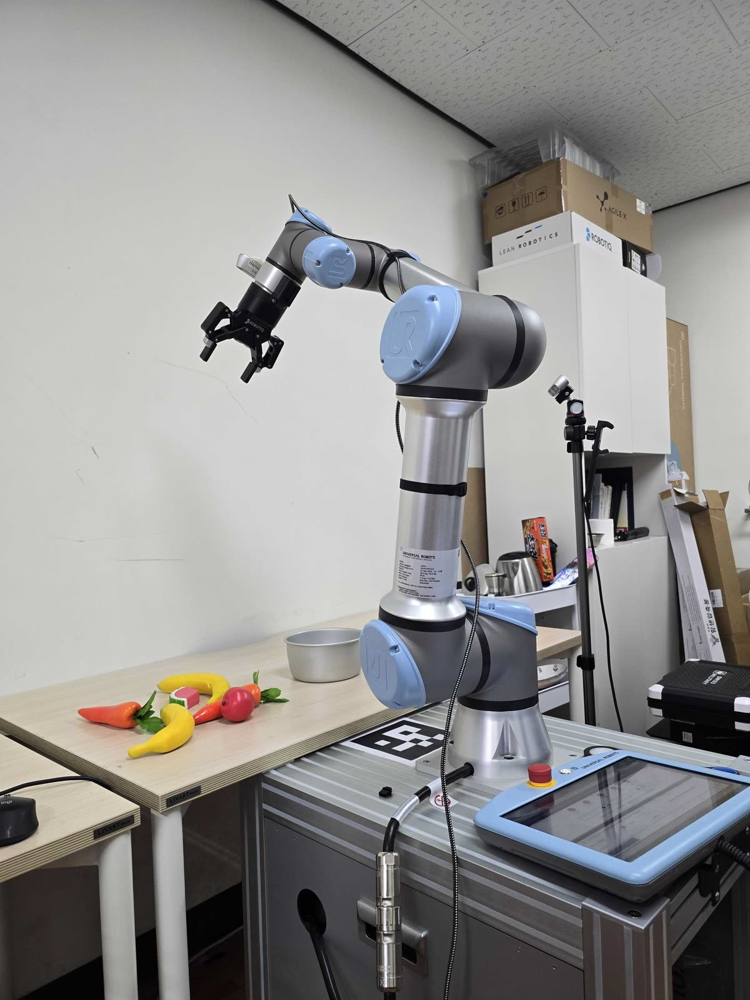

# 🍌 banana-in-pot-experiments

**Reproducible imitation-learning experiments for the "put the right banana in the pot" manipulation task** — UR7e arm, GELLO teleoperation, LeRobot v3.0.



<sub>Physical setup: a **UR7e** arm (right) teleoperated by a **GELLO** leader arm, with two RGB cameras viewing the banana / pot workspace. Same photos as the top of the HF dataset card.</sub>

**Demo video:** https://youtu.be/B3uFWIv8q9k?si=N0IXjRAhibsqBeeI

---

## What this is

51 episodes (**21,524 frames**, 30 fps, ~11.96 min) of dual-RGB-camera GELLO teleoperation on a **UR7e** arm, converted to **LeRobot v3.0**. We train two policy families — **ACT** (Action Chunking Transformer) first, then the **lerobot Diffusion Policy** — under a deliberate **train/val overfit-diagnostic** methodology: hold out the **last 6 of 51 episodes** (`--dataset.eval_split=0.117`, eps 45–50) as a true validation split and watch held-out signals while train loss falls. Everything runs in two action spaces: **JOINT** (7-D: UR q1..q6 + gripper) and **EEF** (10-D: xyz + 6D-rotation + gripper).

> **Robot note:** the LeRobot dataset stores `robot_type=ur5e_gello` (and repo_id `theo/banana_in_pot`). These strings are **legacy metadata artifacts** — the physical arm and all deploy docs are **UR7e**. Do not "fix" the string; downstream code depends on it.

---

## 🔑 Headline finding — for Diffusion, `eval_loss` is a misleading overfit signal

> For the **Diffusion Policy**, held-out **denoising `eval_loss` ROSE** (0.0289 @ 4k → 0.1487 @ 80k — textbook "overfit", 5×) while the deployment-relevant **open-loop rollout MAE kept IMPROVING and then plateaued** (poseMAE 0.1193 @ 10k → 0.0845 @ 80k). The denoising loss scores noise prediction at random diffusion timesteps, not sampled-action accuracy, so the two decorrelate. Over the **full 80k run there was NO open-loop overfitting** — best checkpoint = **80k**. **Select diffusion checkpoints by open-loop MAE, never by `eval_loss`.** For **ACT the two signals agreed** (open-loop best ≈ 30k).

JOINT diffusion, open-loop DDIM-10 on held-out eps 45–50 (`eval_offline.py`, radians):

| checkpoint | poseMAE (rad) | gripAcc |
|---|---|---|
| 10k | 0.1193 | 0.729 |
| 20k | 0.1037 | 0.888 |
| 30k | 0.0921 | 0.919 |
| 40k | 0.0907 | 0.949 |
| 60k | 0.0849 | 0.944 |
| **80k** | **0.0845** | **0.953** |

Full analysis → **[docs/DIFFUSION_JOINT_OVERFIT.md](docs/DIFFUSION_JOINT_OVERFIT.md)**.

### EE (10-D) diffusion results — same lesson, now DONE at 100k

The **EEF** leg (10-D: xyz + 6D-rotation + gripper) confirms the identical pattern: held-out `eval_loss` **rose** 0.0250 @8k → 0.112 @100k (auto-verdict "overfit@8k", misleading) while **open-loop rollout MAE improved then plateaued — NO destructive overfit through 100k.**

EE diffusion, open-loop DDIM-10 on held-out eps 45–50 (own-scale units — mixes meters + 6D rotation, **not comparable** to JOINT's radian poseMAE):

| checkpoint | poseMAE (own scale) | gripAcc | overallL1 |
|---|---|---|---|
| 10k | 0.0665 | 0.886 | 0.0752 |
| 20k | 0.0450 | 0.923 | 0.0503 |
| 30k | 0.0435 | 0.930 | 0.0484 |
| 40k | 0.0400 | 0.926 | 0.0444 |
| 50k | 0.0379 | 0.942 | 0.0413 |
| 60k | 0.0390 | 0.950 | 0.0413 |
| 70k | 0.0369 | 0.956 | 0.0385 |
| 80k | **0.0367** (min) | 0.961 | 0.0377 |
| 90k | 0.0372 | 0.955 | 0.0386 |
| **100k** | 0.0372 | **0.966** | **0.0375** (min) |

**Best = 80k–100k plateau (deploy 100k)** — poseMAE bottoms at 80k but is within noise through 100k, and 100k gives the best gripper accuracy and overall-L1. Full analysis → **[docs/DIFFUSION_EE_OVERFIT.md](docs/DIFFUSION_EE_OVERFIT.md)**.

---

## 🚀 Quickstart

```bash
# 1. Clone with the deploy submodule (gello_software)
git clone --recursive git@github.com:Bigenlight/banana-in-pot-experiments.git
cd banana-in-pot-experiments

# 2. Build the uv venv + locked deps + lerobot pinned-editable (~10 min)
./setup.sh                # smoke line prints: 2.11.0+cu128 True 0.6.1 0.35.2

# 3. Fetch the JOINT dataset from HF (and rebuild the EE-action set for the EEF leg)
./fetch_data.sh

# 4. Gate the GPU before ANY training (fails unless GPU is free)
./gpu_gate.sh

# 5. Train JOINT diffusion (val-diag) — detached so an agent harness can't reap it
setsid nohup ./train_diffusion_joint_valdiag.sh </dev/null >train.log 2>&1 &

# 6. Offline eval + checkpoint selection (DDIM-10 open-loop on held-out eps 45–50)
./lr_env/bin/python eval_offline.py \
    --checkpoint outputs/train/diffusion_joint_val_diag/checkpoints/080000/pretrained_model \
    --episodes 45,46,47,48,49,50 --device cuda --out eval_out_80k
```

> `setsid` returns a **wrapper** pid — find the real training pid with `pgrep -f 'lerobot-train.*diffusion_joint'`. Every must-not-remove flag (`--policy.resize_shape='[360,640]'`, `--policy.drop_n_last_frames=31`, `--dataset.eval_split=0.117`) and the detached-launch gotcha are in **[TROUBLESHOOTING.md](TROUBLESHOOTING.md)**.

---

## 🔗 Key links

**Hugging Face datasets**
- [`Bigenlight/banana_in_pot_lerobot_v3`](https://huggingface.co/datasets/Bigenlight/banana_in_pot_lerobot_v3) — JOINT dataset (LeRobot v3.0, primary)
- [`Bigenlight/banana_in_pot_raw`](https://huggingface.co/datasets/Bigenlight/banana_in_pot_raw) — raw per-take h5 + mp4 (to rebuild datasets)
- [`Bigenlight/banana_in_pot_ee_lerobot_v3`](https://huggingface.co/datasets/Bigenlight/banana_in_pot_ee_lerobot_v3) — EE-observation dataset

**Hugging Face models**
- [`Bigenlight/act_banana_in_pot`](https://huggingface.co/Bigenlight/act_banana_in_pot) — pretrained ACT policy
- [`Bigenlight/diffusion_banana_in_pot_joint`](https://huggingface.co/Bigenlight/diffusion_banana_in_pot_joint) — pretrained JOINT (7-D) diffusion policy, deployed
- [`Bigenlight/diffusion_banana_in_pot_ee`](https://huggingface.co/Bigenlight/diffusion_banana_in_pot_ee) — EE (10-D) diffusion policy @100k — research artifact, needs IK, not wired to the robot
- [`Bigenlight/flow_matching_banana_in_pot_joint`](https://huggingface.co/Bigenlight/flow_matching_banana_in_pot_joint) — JOINT (7-D) **flow-matching** policy (`multi_task_dit`) @70k — **best JOINT open-loop MAE of the three families**
- [`Bigenlight/banana_in_pot_hilserl`](https://huggingface.co/Bigenlight/banana_in_pot_hilserl) — HIL-SERL prep artifacts

**Code**
- Deploy stack (submodule): [`Bigenlight/gello_software`](https://github.com/Bigenlight/gello_software) — real-UR7e ROS2 **Humble** deploy, branch `feat/gello-ur7e-humble-22.04`; diffusion deploy runbook lives at `gello_software/docs/ros2/GELLO_UR7E_DIFFUSION_DEPLOY.md`
- Upstream [lerobot](https://github.com/huggingface/lerobot) pinned @ `8a74e0a` (0.6.1) — cloned editable by `setup.sh`, not a submodule

**In-repo docs**

| Doc | One-liner |
|---|---|
| [docs/DATASET_REPORT.md](docs/DATASET_REPORT.md) | LeRobot v3.0 conversion + 6-validator QA (schema, coverage, video, alignment, sanity, train-readiness). |
| [docs/ACT_RESULTS.md](docs/ACT_RESULTS.md) | ACT training results on the 51-episode dataset. |
| [docs/ACT_OVERFIT_DIAGNOSIS.md](docs/ACT_OVERFIT_DIAGNOSIS.md) | ACT train/val diagnostic — loss and open-loop MAE agree (best ≈ 30k). |
| [docs/DIFFUSION_PLAN.md](docs/DIFFUSION_PLAN.md) | Execution-ready spec for the diffusion JOINT→EEF diagnostic. |
| [docs/DIFFUSION_JOINT_OVERFIT.md](docs/DIFFUSION_JOINT_OVERFIT.md) | **The headline finding**: `eval_loss` rises while open-loop MAE improves. |
| [docs/DIFFUSION_EE_OVERFIT.md](docs/DIFFUSION_EE_OVERFIT.md) | EE (10-D) diffusion overfit diagnostic — same `eval_loss`-misleading lesson; open-loop conclusion: no overfit through 100k, best = 80k–100k plateau. |
| [docs/FM_JOINT_RESULTS.md](docs/FM_JOINT_RESULTS.md) | **Flow-matching (`multi_task_dit`) JOINT results** — 3rd policy family; `eval_loss`-vs-open-loop divergence reproduced; **FM beats Diffusion & ACT** (best poseMAE 0.0735 @ 70k). |
| [docs/FM_JOINT_MODEL_CARD.md](docs/FM_JOINT_MODEL_CARD.md) | Flow-matching model card — how it was trained + how to use/deploy (mirror of the HF card). |
| [docs/DEPLOY_REPO_DECISION.md](docs/DEPLOY_REPO_DECISION.md) | Repo-setup decision for real-robot ACT/HIL-SERL deploy on the UR7e. |
| [docs/DEPLOY_UR.md](docs/DEPLOY_UR.md) | How to run the trained ACT policy on the real UR arm. |
| [docs/HILSERL_PREP_PLAN.md](docs/HILSERL_PREP_PLAN.md) | Offline, robot-free plan up to HIL-SERL online RL. |
| [docs/HILSERL_PREP_RESULTS.md](docs/HILSERL_PREP_RESULTS.md) | Results of the offline HIL-SERL preparation. |
| [docs/HILSERL_RUNBOOK.md](docs/HILSERL_RUNBOOK.md) | HIL-SERL online training runbook (UR7e). |
| [REPRODUCIBILITY_PLAN.md](REPRODUCIBILITY_PLAN.md) | Full design rationale, splits, and flag decisions. |
| [TROUBLESHOOTING.md](TROUBLESHOOTING.md) | Symptom→fix table + must-not-remove flags + detached-launch cautions. |
| [EXPERIMENT_LOG.md](EXPERIMENT_LOG.md) | Narrative timeline of the experiments. |

---

## 🗂️ Repo layout

```
banana-in-pot-experiments/
├── setup.sh  fetch_data.sh  gpu_gate.sh      # environment + data + GPU gate
├── train_act*.sh  train_diffusion_*.sh       # training entry points (JOINT & EEF)
├── convert_to_lerobot*.py                     # raw → LeRobot v3.0 converters (JOINT / EE)
├── eval_offline.py                            # open-loop offline eval (DDIM-10, --smoke)
├── validate_ee_dataset.py  make_*_report.py   # QA + report generators
├── deploy_ur_act.py                           # reference deploy inference-loop skeleton
├── docs/                                       # 10 design/results/deploy docs (table above)
├── results/                                    # eval_out_*k/, report_assets/ (committed)
├── assets/                                     # setup/workspace photos (this README)
└── gello_software/                             # submodule — real-UR7e ROS2 Humble deploy
```

Nothing large is committed (repo < 1 MB, no git-lfs) — datasets/models are fetched from HF or rebuilt.

---

## 🖥️ Hardware / deps

**RTX 3060 12GB · NVIDIA driver ≥ 570 · CUDA cu128 (`torch==2.11.0+cu128`) · Python 3.12 (uv venv, `lerobot==0.6.1`) · Ubuntu 22.04 (deploy only, ROS2 Humble).** Full pinned environment → [`setup.sh`](setup.sh) + [`requirements-lock.txt`](requirements-lock.txt). Bitwise reproduction is a non-goal — a different GPU changes nondeterminism, so numbers match in *shape* (curve trends, MAE ranking), not exact digits.

---

## 📄 License

See **[LICENSE_NOTE.md](LICENSE_NOTE.md)**. HF dataset cards are **apache-2.0**; robot-data usage recommendation is **CC-BY-NC** (contains real lab-workspace video) — to be confirmed by the lab before finalizing. `lerobot` (Apache-2.0) and `gello_software` keep their upstream licenses.
