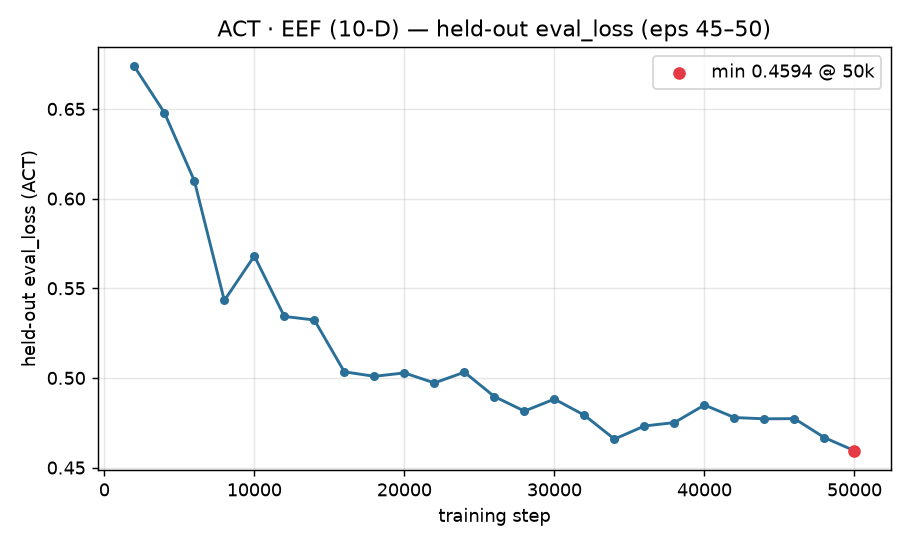
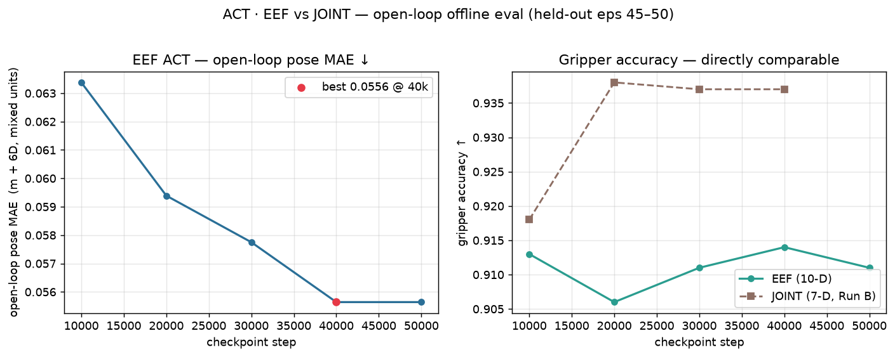

# ACT · EEF (10-D) — Results

**Status:** complete. ACT trained on the **end-effector (EEF) 10-D action space** to 50k
steps, evaluated open-loop on the held-out episodes, and set up for a like-for-like
comparison against the JOINT-space ACT baseline. See the side-by-side scaffold in
[JOINT_VS_EEF_ACT_COMPARISON.md](JOINT_VS_EEF_ACT_COMPARISON.md).

## TL;DR
- Trained **ACT** in EEF space (`train_act_ee_valdiag.sh`), 50k steps, one RTX A4000, ~2h43m,
  no crashes, **no overfitting**. Held-out `eval_loss` fell monotonically to **0.4594 @ 50k**.
- **Best checkpoint = 40k** by open-loop MAE (poseMAE **0.05564**, overallL1 **0.05943**,
  gripAcc **0.914**); 50k is effectively tied. `eval_loss` (→50k) and open-loop MAE (→40k)
  **agree** for ACT — pick by open-loop MAE per repo convention.
- **JOINT vs EEF caveat:** pose MAE units differ (JOINT = radians, EEF = metres + 6D rotation)
  and are **not** value-comparable. The one directly comparable metric, **gripper accuracy**,
  is slightly *lower* for EEF (0.906–0.914) than the JOINT held-out baseline (0.918–0.938),
  Δ = −0.005…−0.032. A rigorous verdict needs a common yardstick (real-robot success, or FK to
  a shared space) — see §6 and §9.
- Fully reproduced in a thin Docker image on a shared box; **5 non-obvious fixes** documented (§7).

Contents: [1. Overview](#1-overview--goal) · [2. Config parity](#2-configuration-parity) ·
[3. Dataset](#3-dataset) · [4. Training curve](#4-training-curve) ·
[5. Open-loop eval](#5-open-loop-offline-eval-per-checkpoint) ·
[6. JOINT vs EEF](#6-joint-vs-eef--interpretation) · [7. Reproducibility](#7-reproducibility-docker) ·
[8. Reproduce commands](#8-how-to-reproduce-commands) · [9. Next steps](#9-next-steps)

---

## 1. Overview & goal

This report evaluates ACT (Action Chunking Transformer) trained in an **end-effector (EEF) action space** on the `banana_in_pot` manipulation task ("put the right banana in the pot", UR7e arm, GELLO teleop demonstrations), and documents how this run compares configuration-for-configuration against the existing **joint-space (7-D)** ACT baseline.

The goal is a controlled, apples-to-apples comparison: same policy family, same hyperparameters, same held-out episodes, same training budget — the *only* deliberate change is the representation of `observation.state` / `action`, from 7-D absolute joint targets to 10-D absolute end-effector pose + gripper. Any difference in train/held-out loss behavior between the two runs can then be attributed to the action-space choice rather than to confounding changes in data split, optimizer settings, or model capacity.

Stack: LeRobot v3.0 (HF `lerobot` 0.6.1), ACT policy with a ResNet18 visual backbone and VAE, **51.6M parameters** (`num_learnable_params = 51,605,386`).

## 2. Configuration parity

The EEF run is launched by `train_act_ee_valdiag.sh`, which is a byte-for-byte mirror of the JOINT baseline's `train_act_valdiag.sh`, with exactly three intentional differences (dataset, step count, and job naming) and one behavioral note (normalization requires no code change):

| Setting | JOINT baseline (`train_act_valdiag.sh`) | EEF run (`train_act_ee_valdiag.sh`) | Same? |
|---|---|---|---|
| `--dataset.repo_id` | `theo/banana_in_pot` | `theo/banana_in_pot_ee_action` | changed |
| `--dataset.root` | `./banana_in_pot_lerobot` | `./banana_in_pot_ee_action_lerobot` | changed |
| `--steps` | 80,000 (file default) / run as 50,000 valdiag | **50,000** | matched to JOINT's actual valdiag run |
| `job_name` / `output_dir` | `act_banana_val_diag` | `act_ee_val_diag` | changed (naming only) |
| `--policy.type` | `act` | `act` | identical |
| `--dataset.eval_split` | `0.117` | `0.117` | identical |
| `--batch_size` | `8` | `8` | identical |
| `--seed` | `1000` | `1000` | identical |
| Image transforms | resize to `[360, 640]`, `max_num_transforms=1` | resize to `[360, 640]`, `max_num_transforms=1` | identical |
| `--save_freq` | `10000` | `10000` | identical |
| `--eval_steps` | `2000` | `2000` | identical |
| `--log_freq` | `200` | `200` | identical |
| `--num_workers` | `4` | `4` | identical |
| `--wandb.enable` | `false` | `false` | identical |

Because `--dataset.eval_split=0.117` is identical in both runs, LeRobot holds out the **same last `ceil(51 × 0.117) = 6` episodes** (episodes 45–50) in both the JOINT and EEF datasets, training on the other 45 and logging held-out eval loss every 2,000 steps — so the train/eval split boundary is not a confound either.

ACT uses `MEAN_STD` (per-dimension) normalization for both state and action, and its state/action dimensionality is auto-derived from the dataset's feature spec. Consequently **no policy code change was required** to move ACT from the 7-D joint space to the 10-D EEF space — only the dataset pointer and step count changed, per the table above.

## 3. Dataset

The EEF dataset, `banana_in_pot_ee_action_lerobot` (repo id `theo/banana_in_pot_ee_action`), was produced by `convert_to_lerobot_ee_action.py` via **video reuse** from the existing JOINT-space dataset: the AV1 camera videos were copied as-is, and only the action/state parquet files and dataset statistics were regenerated. No forward kinematics was needed — the raw source HDF5 already contains the UR controller's recorded TCP pose (`tcp_pose`), which was cross-validated to ~0.85 mm agreement with the alternative FK path. Rotation is stored as the Zhou et al. 6D continuous rotation representation, converted from the source quaternion.

| Property | Value |
|---|---|
| Episodes | 51 |
| Frames | 21,524 |
| Frame rate | 30 fps |
| Held-out episodes (eval split) | 45, 46, 47, 48, 49, 50 (6 episodes, `eval_split=0.117`) |
| Train episodes | 45 |

**Feature layout — EEF (10-D) vs. JOINT (7-D) baseline:**

| Dim group | EEF (this run) | JOINT (baseline) |
|---|---|---|
| Position | `x, y, z` (metres, absolute next-frame TCP pose) | — |
| Rotation | `r1 … r6` (Zhou et al. 6D rotation) | `q1 … q6` (absolute joint targets, rad) |
| Gripper | 1-D | 1-D |
| **Total `observation.state` / `action` dim** | **10** | **7** |

Both `observation.state` and `action` follow the shift convention `action[k] = pose[k+1]`, `state[k] = pose[k]`.

The dataset passed all **8/8 checks** in `validate_ee_dataset.py`: episode/frame counts, shapes and dtypes/names, absence of NaN/Inf, quaternion↔6D round-trip correctness, correct action/state shift alignment, temporal continuity, populated per-dimension normalization statistics, and a bimodal gripper-value distribution.

## 4. Training curve

Training ran for 50,000 steps on a single RTX A4000 (GPU 3), ~2h43m wall-clock at ~6.2–6.4 step/s, with no crashes.


*Held-out `eval_loss` (episodes 45–50), logged every 2000 steps.*

`eval_loss` fell from **0.6737 @ 2k** to **0.4594 @ 50k (min)**, with the usual early-training noise (e.g. 8k=0.5432 → 10k=0.5680) settling into a smooth decline after ~16k:

| step | eval_loss | step | eval_loss | step | eval_loss |
|---|---|---|---|---|---|
| 2000  | 0.6737 | 18000 | 0.5009 | 34000 | 0.4659 |
| 4000  | 0.6480 | 20000 | 0.5028 | 36000 | 0.4732 |
| 6000  | 0.6100 | 22000 | 0.4972 | 38000 | 0.4751 |
| 8000  | 0.5432 | 24000 | 0.5032 | 40000 | 0.4849 |
| 10000 | 0.5680 | 26000 | 0.4896 | 42000 | 0.4779 |
| 12000 | 0.5343 | 28000 | 0.4815 | 44000 | 0.4772 |
| 14000 | 0.5323 | 30000 | 0.4882 | 46000 | 0.4773 |
| 16000 | 0.5034 | 32000 | 0.4792 | 48000 | 0.4667 |
|       |        |       |        | 50000 | **0.4594** |

No upturn appears anywhere in the curve, including the last ~15k steps — i.e. **no destructive overfitting**, and the run was safe to train to the full 50k budget.

## 5. Open-loop offline eval (per checkpoint)

Open-loop eval (`eval_offline.py`, predicted action vs. dataset ground truth, teacher-forced) on the same held-out episodes (45–50). Metrics are in **native EEF units**: pose MAE mixes metres (x/y/z) with the unitless Zhou 6D rotation representation (r1..r6), so `poseMAE` should be read as a rollup indicator, not a physical distance.


*EEF pose MAE and gripper accuracy vs. checkpoint, with JOINT Run-B gripper accuracy overlaid for reference.*

| checkpoint | pose MAE (m + 6D) | gripper acc | overall L1 |
|---|---|---|---|
| 10000 | 0.06338 | 0.913 | 0.06883 |
| 20000 | 0.05939 | 0.906 | 0.06434 |
| 30000 | 0.05775 | 0.911 | 0.06173 |
| 40000 | **0.05564** | **0.914** | **0.05943** |
| 50000 | 0.05564 | 0.911 | 0.05947 |

**Best checkpoint: 40k**, by open-loop MAE — lowest `overallL1` (0.05943); 50k ties on `poseMAE` but is marginally worse on `overallL1` and gripper accuracy. `eval_loss` alone would point to 50k (0.4594, the run minimum). For ACT these two signals **agree closely** (both favor the last few checkpoints), consistent with the repo's general finding that ACT's `eval_loss` and open-loop MAE track together (unlike diffusion, where they diverge). Following repo convention of selecting by open-loop MAE, the recommended checkpoint is **40k** (effectively a 40k/50k tie).

Per-dimension MAE at the 50k checkpoint (aggregated over all evaluated frames):

| dim | MAE | units |
|---|---|---|
| x | 0.02766 | m |
| y | 0.02340 | m |
| z | 0.03618 | m |
| r1 | 0.08927 | 6D |
| r2 | 0.04572 | 6D |
| r3 | 0.07187 | 6D |
| r4 | 0.04668 | 6D |
| r5 | 0.08071 | 6D |
| r6 | 0.07925 | 6D |
| grip | 0.09393 | grip |

## 6. JOINT vs EEF — interpretation

**Units caveat, read first:** JOINT and EEF policies predict in different spaces, so their headline error numbers are **not comparable as raw values**. JOINT open-loop pose MAE is in **radians** (per-joint); EEF open-loop pose MAE mixes **metres** (x/y/z) with **unitless** 6D-rotation components. An EEF pose MAE of 0.056 is not "better" or "worse" than a JOINT pose MAE of 0.098 — they are different units measuring different quantities. `eval_loss` is likewise not value-comparable across the 7-D (JOINT) vs. 10-D (EEF) action spaces, since ACT's loss is computed in each dataset's own normalized action space.

**The one directly comparable metric is gripper accuracy**, since both action spaces carry the same gripper channel:

| checkpoint | JOINT grip acc (Run B) | EEF grip acc | Δ (EEF − JOINT) |
|---|---|---|---|
| 10000 | 0.918 | 0.913 | −0.005 |
| 20000 | 0.938 | 0.906 | −0.032 |
| 30000 | 0.937 | 0.911 | −0.026 |
| 40000 | 0.937 | 0.914 | −0.023 |

Across all four checkpoints, EEF gripper accuracy sits **slightly below** the JOINT (Run B) baseline, by 0.5–3.2 points. This is a small but consistent gap — not evidence of a large representation effect, but directionally the EEF run is not gripper-better than JOINT on this one apples-to-apples channel.

Beyond gripper accuracy, no rigorous "which representation is better" verdict can be drawn from the numbers on hand: JOINT Run A (trained on all 51 episodes, evaluated in-sample: 50k pose MAE 0.0237 rad, gripAcc 99.2%) is not a fair generalization baseline and should not be compared to the EEF held-out run at all. JOINT Run B (true held-out, same recipe, early-stopped ~45k: pose MAE 0.1055/0.1057/0.0978(best)/0.1000 rad at 10/20/30/40k, gripAcc 0.918/0.938/0.937/0.937, eval_loss min 0.5252@44k) is the fair comparison point for gripper accuracy, but its pose-space numbers remain unitwise incomparable to EEF's. A fresh JOINT ACT run to 50k (in progress on another machine) will fill in the missing 50k JOINT row but will not resolve the units problem on its own.

A genuine, common-yardstick verdict requires either: (a) real-robot task success rate for each representation, or (b) converting JOINT-policy joint predictions to EEF pose via forward kinematics so both policies' errors can be compared in the same (metres + rotation) space offline.

## 7. Reproducibility (Docker)

This experiment ran on a **shared multi-GPU box** (8× RTX A4000 16GB, host NVIDIA driver 550.144.03 / CUDA 12.4), so the run was containerized to avoid polluting the shared machine. The container is invoked with `--user 1001:1001` (the host user) so nothing root-owned gets left behind on the mounted repo.

**Why Docker, and why the image is thin:** `banana-eef:latest` (1.59 GB) is built `FROM python:3.12` — no `nvidia/cuda` base image is needed. The key insight is that the CUDA *userspace* ships inside the pip `torch` cu128 wheels; only the host NVIDIA driver + `libcuda` are used at runtime, injected by `nvidia-container-toolkit` (default runtime already `nvidia`). This was verified empirically: torch `2.11.0+cu128` (CUDA 12.8) ran successfully — `is_available() == True` plus a real matmul on the A4000 — on top of host driver 550 (CUDA 12.4), via CUDA 12.x minor-version compatibility (the driver floor for 12.x is ~525). The Python env (`lr_env`, a `uv` venv) and the datasets are **not** baked into the image; they are built at runtime into the mounted `/workspace` by the repo's own `setup.sh` and `fetch_data.sh`, so they persist on the host (gitignored, user-owned) while the image itself stays thin and reproducible.

Getting a clean, non-root, GPU-capable run out of this thin image required five non-obvious fixes, four baked into `docker/` and one applied as a runtime flag:

1. **uv dependency resolution across two indexes.** Symptom: `uv pip install -r requirements-lock.txt` failed to resolve `certifi==2026.6.17`, a PyPI package, because newer `uv` (>=0.11.x) defaults to resolving each package against only the *first* index it's seen on (a dependency-confusion guard), and the PyTorch cu128 extra index also serves `certifi`. Fix: `ENV UV_INDEX_STRATEGY=unsafe-best-match` in the Dockerfile. Both indexes (PyPI, PyTorch) are official/trusted, so best-match resolution across them is safe and reproduces the original lockfile exactly.
2. **Stale venv blocks re-runs.** Symptom: a previously failed `setup.sh` leaves a broken `lr_env` stump that a subsequent `uv venv lr_env` refuses to overwrite. Fix: pass `UV_VENV_CLEAR=1` as an environment variable on re-runs of the setup container.
3. **`getpwuid` crash under a UID with no passwd entry.** Symptom: running as `--user 1001` (a UID not present in the image's `/etc/passwd`) crashes with a `KeyError` from `pwd.getpwuid`, because torch's inductor cache-dir logic calls `getpass.getuser()` which falls back to a `pwd` lookup. Fix: `ENV USER=lerobot` in the Dockerfile — `getpass.getuser()` checks `$USER` before touching `pwd`, so this short-circuits the crash (the value is cosmetic; only used to name cache subdirs).
4. **Missing NVIDIA NPP for `torchcodec`'s CUDA decoder.** Symptom: `torchcodec`'s CUDA video decoder `dlopen()`s `libnppicc.so.12` (NVIDIA Performance Primitives) at first-decode time. On the original box these libs came from a system-wide CUDA install, so they were never captured in `requirements-lock.txt` (a pip freeze) and are absent from this thin, system-CUDA-free image. Fix: `pip install nvidia-npp-cu12==12.4.1.87` (`docker/requirements-extra.txt`), plus `docker/entrypoint.sh`, which finds every `nvidia/*/lib` directory under the mounted `lr_env` site-packages and prepends them to `LD_LIBRARY_PATH` before `exec`'ing the requested command.
5. **Shared memory too small for the DataLoader.** Symptom: training crashed at step 2000 (the first eval) with `unable to allocate shared memory (shm) ... Resource temporarily unavailable (11)` — Docker's default `/dev/shm` is 64MB, too small for PyTorch's `DataLoader` with `num_workers=4`. Fix: add `--shm-size=16g` to the training `docker run` invocation (a runtime flag, not baked into the image). `num_workers` was deliberately left at 4 rather than lowered, to preserve parity with the JOINT baseline run.

**Files added:**
- `docker/Dockerfile` — thin `python:3.12` image, `uv` install, env vars for the fixes above, entrypoint wiring.
- `docker/entrypoint.sh` — puts the mounted `lr_env`'s pip-provided NVIDIA `lib` dirs onto `LD_LIBRARY_PATH` before exec.
- `docker/requirements-extra.txt` — container-only extra dependency (`nvidia-npp-cu12`) not present in the upstream `requirements-lock.txt`.
- `train_act_ee_valdiag.sh` — EEF (10-D end-effector action) counterpart of `train_act_valdiag.sh`, mirroring it byte-for-byte except for dataset repo/root, `--steps=50000`, and job name/output dir.
- `make_act_ee_report.py` — report/plot generation for the ACT-EEF run.

## 8. How to reproduce (commands)

All commands run as the host user (`1001:1001`) with `HOME=/workspace`, with the repo mounted at `/workspace`. Replace `<repo>` with the absolute path to this repo on the host, `<STEP>` with a checkpoint step, and adjust `--gpus '"device=3"'` to the GPU you want on the shared box.

```bash
# 1. Build the image
docker build -t banana-eef:latest -f docker/Dockerfile docker/

# 2. Set up the Python env + fetch datasets (CPU-only container run)
docker run --rm --user 1001:1001 -e HOME=/workspace -e UV_VENV_CLEAR=1 \
  -v <repo>:/workspace banana-eef:latest \
  bash -lc './setup.sh && source lr_env/bin/activate && ./fetch_data.sh all'

# 3. Train (GPU, detached, one GPU on the shared box)
docker run -d --name banana-train-ee --gpus '"device=3"' --shm-size=16g \
  --user 1001:1001 -e HOME=/workspace \
  -v <repo>:/workspace banana-eef:latest \
  bash -lc './train_act_ee_valdiag.sh'

# 4. Evaluate one checkpoint (metrics print to stdout only — tee to capture;
#    eval_offline.py defaults --root/--repo-id to the JOINT dataset, so the
#    EEF dataset flags below MUST be passed explicitly)
docker run --rm --gpus '"device=3"' --shm-size=16g \
  --user 1001:1001 -e HOME=/workspace -e HF_HUB_OFFLINE=1 \
  -v <repo>:/workspace banana-eef:latest \
  bash -lc './lr_env/bin/python eval_offline.py \
      --checkpoint outputs/train/act_ee_val_diag/checkpoints/<STEP>/pretrained_model \
      --root ./banana_in_pot_ee_action_lerobot \
      --repo-id theo/banana_in_pot_ee_action \
      --episodes 45,46,47,48,49,50 \
      --device cuda \
      --out results/eval_ee_act_<STEP>'

# 5. Generate plots/report
docker run --rm --user 1001:1001 -e HOME=/workspace \
  -v <repo>:/workspace banana-eef:latest \
  bash -lc './lr_env/bin/python make_act_ee_report.py'
```

## 9. Next steps

To turn this into a rigorous JOINT-vs-EEF verdict:
1. **Import the fresh JOINT ACT 50k run** (other PC) into [JOINT_VS_EEF_ACT_COMPARISON.md](JOINT_VS_EEF_ACT_COMPARISON.md) — its `eval_loss` curve and per-checkpoint `eval_offline` numbers fill the JOINT columns for a true like-for-like (Run B stopped at ~45k).
2. **Common-space offline comparison via FK** — convert the JOINT policy's joint-action predictions to EEF pose (UR7e forward kinematics; the repo's FK lived under the gitignored `/hilserl/`) and compare both policies' error in the same metres+rotation space. This is the cleanest offline apples-to-apples.
3. **Real-robot task success** — the gold standard. JOINT deploys via `servoJ` (`deploy_ur_act.py`); EEF would need `servoL`/IK. Run N trials of "banana in pot" per selected checkpoint and report success %.

## Artifacts
- Training log: `outputs/train/act_ee_val_diag/train.log`; checkpoints `outputs/train/act_ee_val_diag/checkpoints/{010000..050000}/`.
- Per-checkpoint eval: `results/eval_ee_act_<step>/metrics.txt` (+ trajectory PNGs).
- Graphs: `results/report_assets/act_ee_loss_curve.png`, `results/report_assets/act_ee_eval_trend.png`.
- Comparison scaffold: [docs/JOINT_VS_EEF_ACT_COMPARISON.md](JOINT_VS_EEF_ACT_COMPARISON.md).
- Docker reproducibility details also in memory: `docker-eef-build-gotchas`.
