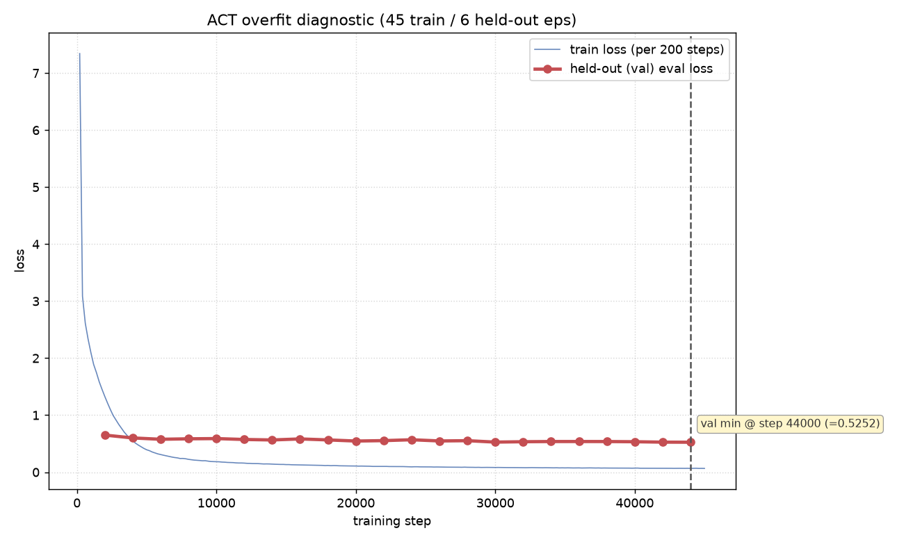

# ACT Overfit Diagnosis

_ACT trained on 45 episodes, 6 episodes (eps 45-50) held out as a true validation split. Train loss logged every 200 steps; held-out eval loss every 2000 steps._

## Held-out eval points

| step | train_loss (nearest) | val / held-out loss |
|-----:|---------------------:|--------------------:|
| 2000 | 1.3280 | 0.6505 |
| 4000 | 0.5530 | 0.6006 |
| 6000 | 0.3090 | 0.5772 |
| 8000 | 0.2250 | 0.5853 |
| 10000 | 0.1830 | 0.5893 |
| 12000 | 0.1590 | 0.5736 |
| 14000 | 0.1410 | 0.5650 |
| 16000 | 0.1260 | 0.5832 |
| 18000 | 0.1180 | 0.5657 |
| 20000 | 0.1080 | 0.5461 |
| 22000 | 0.1000 | 0.5534 |
| 24000 | 0.0930 | 0.5689 |
| 26000 | 0.0900 | 0.5476 |
| 28000 | 0.0860 | 0.5524 |
| 30000 | 0.0820 | 0.5275 |
| 32000 | 0.0780 | 0.5341 |
| 34000 | 0.0760 | 0.5376 |
| 36000 | 0.0750 | 0.5378 |
| 38000 | 0.0720 | 0.5374 |
| 40000 | 0.0710 | 0.5340 |
| 42000 | 0.0680 | 0.5267 |
| 44000 | 0.0660 | 0.5252 |

## Summary

- **Val-loss minimum:** 0.5252 @ step **44000**
- **Final val loss:** 0.5252 @ step 44000
- **val_final / val_min ratio:** 1.0000
- **Train vs val at final step (44000):** train 0.0660 vs val 0.5252 (gap = -0.4592)
- **Recommended early-stop step:** 44000 (step of the val-loss minimum)

## Auto verdict

> **NO OVERFIT (val still improving)**

The held-out loss is still at (or near) its minimum at the most recent eval: it bottoms at 0.5252 (step 44000) and finishes at 0.5252, within 2% of the min. No sign of the val curve turning back up, so training longer is not yet hurting generalization. Keep the latest checkpoint; the natural early-stop point is currently the end of the run.

## How to read this (caveats)

- **Train and val magnitudes are NOT directly comparable.** The train loss is logged with dropout active and is a running-average tracker over recent batches; the held-out eval loss is computed under `policy.eval()` (dropout off) on unseen episodes. A raw train-below-val gap is expected and is *not* itself evidence of overfitting.
- **Only the trends and the val-curve shape matter.** Overfitting shows up as the held-out (red, bold) curve flattening and then turning *upward* while train loss keeps dropping. The vertical dashed line marks the val minimum = the recommended early-stop step.
- ACT total loss = L1 reconstruction + KLD (VAE) term; both series use the same total-loss definition.
- Generated by `make_overfit_report.py`; safe to re-run on the growing log at any time.

---

## Final conclusion (early-stopped at step 45,000 — 2026-07-09)

The diagnostic was intentionally early-stopped at ~45k (of a planned 80k) once the answer was clear; the GPU was handed to the diffusion-policy experiments.

**Verdict: NO destructive overfitting.** Held-out `eval_loss` fell 0.6505 (2k) → **0.5252 (44k, the minimum)** and never turned up — it slowly kept improving, with the marginal gain flattening after ~30k. Best held-out step ≈ **30k–44k** (essentially tied in the 0.525–0.535 band).

**Clean open-loop held-out MAE** (`eval_offline.py`, teacher-forced over held-out eps 45–50, radians):

| checkpoint | poseMAE (rad) | gripAcc | overall L1 |
|---|---|---|---|
| 10k | 0.1055 | 0.918 | 0.1058 |
| 20k | 0.1057 | 0.938 | 0.1024 |
| **30k** | **0.0978** | 0.937 | **0.0954** |
| 40k | 0.1000 | 0.937 | 0.0967 |

The open-loop signal agrees with the loss curve: it improves to ~30k then stops improving (40k marginally worse) → **best checkpoint ≈ 30k**.

**Practical takeaways**
- The deploy model (trained on all 51 eps to 80k) is **not** at risk of the "val rises while train falls" failure mode — this recipe does not destructively overfit this dataset.
- Held-out generalization **stops improving after ~30k**; extra steps mostly reduce train loss without helping unseen data → for a *held-out* setup, ~30k is the sweet spot. (The deploy model still benefits from using all 51 episodes.)
- There is a real train-vs-held-out **generalization gap** (held-out open-loop ≈ 0.10 rad) — expected for a 45–51 episode imitation dataset; more demonstrations are the lever to close it.

**Caveats**
- Held-out eps 45–50 are the **last 6 by collection order** (chronological tail), not an i.i.d. random split — the gap conflates generalization with any session drift. A random-split re-run would tighten this, but the "no destructive overfit" conclusion is robust to it.
- This diagnostic characterizes the **recipe's** generalization tendency (an independent 45-ep model), not the exact deploy weights; it is a strong inference, not a direct measurement of the 80k deploy checkpoint.
