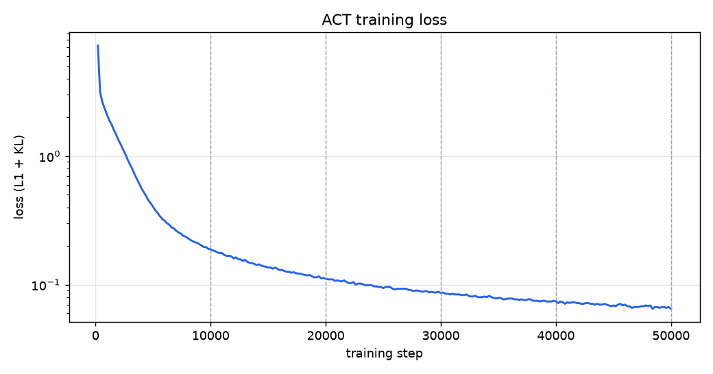
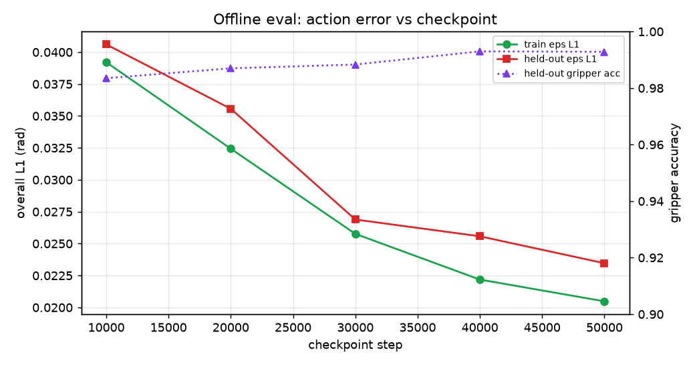
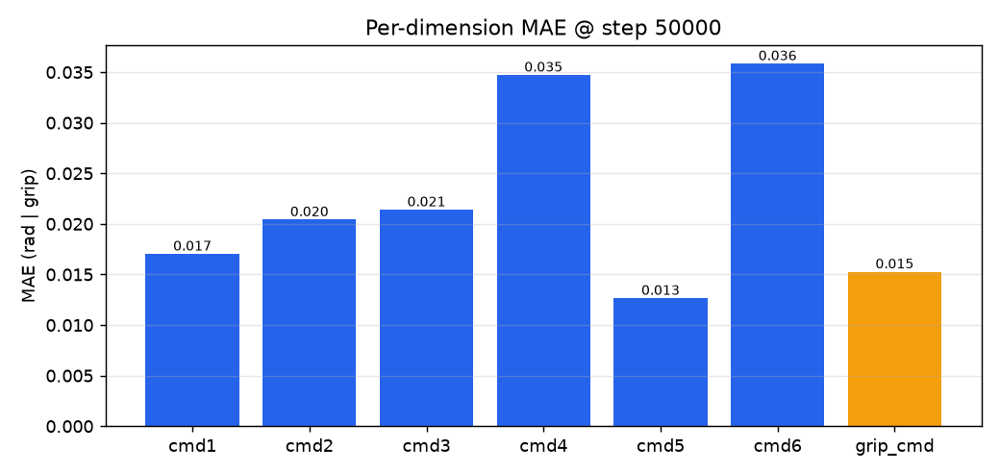
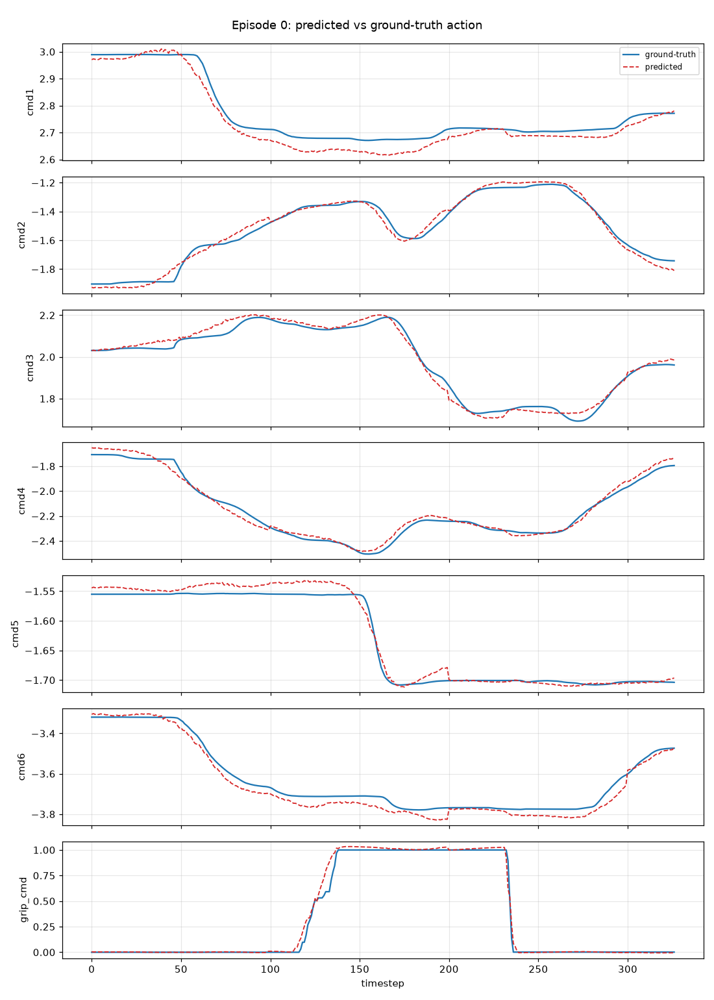
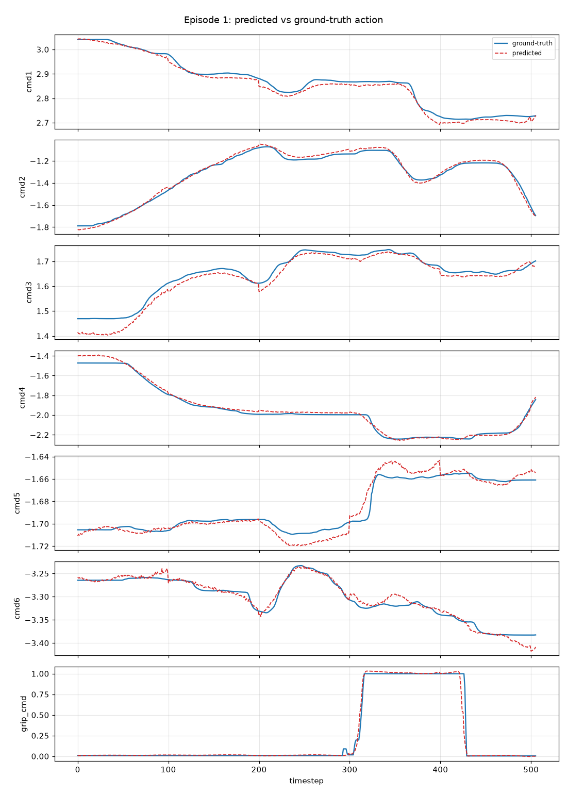

# ACT 학습 결과 — Put the right banana in the pot

> LeRobot v3.0 데이터셋(51 에피소드, UR7e + 2 cam)으로 학습한 ACT(Action Chunking Transformer) 정책.

**상태:** 완료 ✅  |  **최종/현재 loss:** 0.065

## 학습 설정
| 항목 | 값 |
|---|---|
| 정책 | ACT (ResNet18 backbone, VAE, chunk_size=100) |
| 입력 | observation.state(7: UR q1~6 + grip_pos), cam1/cam2 @360×640 |
| 출력(action) | 7: cmd1~6(절대 관절각, rad) + grip_cmd |
| 이미지 | 720p → **360×640 on-the-fly resize** (재인코딩 없음) |
| batch / steps | 8 / 50,000 |
| optimizer | AdamW, lr 1e-5 (constant), pretrained ImageNet backbone |
| GPU | RTX 3060 12GB (~4.7GB 사용, ~3.9 step/s) |

## 학습 loss 곡선

*점선 = 체크포인트 저장 지점.*

## 체크포인트별 오프라인 평가 (open-loop: 예측 액션 vs 정답)

*train 에피소드와 held-out 에피소드의 오차가 거의 같음 = 과적합 없음 / 일반화됨.*

| step | joints MAE (rad) | overall L1 | gripper acc | train L1 | held-out L1 |
|---|---|---|---|---|---|
| 10000 | 0.0392 | 0.0395 | 98.0% | 0.0392 | 0.0406 |
| 20000 | 0.0354 | 0.0345 | 98.8% | 0.0324 | 0.0356 |
| 30000 | 0.0267 | 0.0265 | 98.8% | 0.0258 | 0.0269 |
| 40000 | 0.0256 | 0.0245 | 99.2% | 0.0222 | 0.0256 |
| 50000 ⭐ | 0.0237 | 0.0225 | 99.2% | 0.0205 | 0.0235 |

⭐ = held-out 기준 최적 체크포인트 (step 50000).

## 관절별 오차 (최적 체크포인트)

*손목(cmd6)이 상대적으로 큼 — 원래 변동이 큰 축. 그리퍼는 이진에 가까움.*

## 예측 vs 정답 궤적 (샘플 에피소드)

*파랑=정답(teleop), 주황=ACT 예측. 7개 액션 차원.*

## 해석 / 데이터셋 판정
- 최적(step 50000) held-out overall L1 = **0.0235 rad** (≈ 1.34°), train = 0.0205 → **갭 거의 없음 = 과적합 없이 일반화**.
- 관절 MAE **0.0237 rad (≈ 1.36°)**, 그리퍼 정확도 **99.2%**.
- **오프라인 지표상 데이터셋은 학습 가능하고 일관적 = '괜찮다'.** 최종 판정은 실로봇 closed-loop(deploy) 필요.

---
- 배포: `DEPLOY_UR.md` + `deploy_ur_act.py` (UR7e, ur_rtde).
- 최적 체크포인트: `outputs/train/act_banana_in_pot/checkpoints/050000/pretrained_model`
- 평가 재현: `lr_env/bin/python eval_offline.py --checkpoint <ckpt> --episodes 0,1,2,45,46,47,48,49,50 --device cuda --out <dir>`
