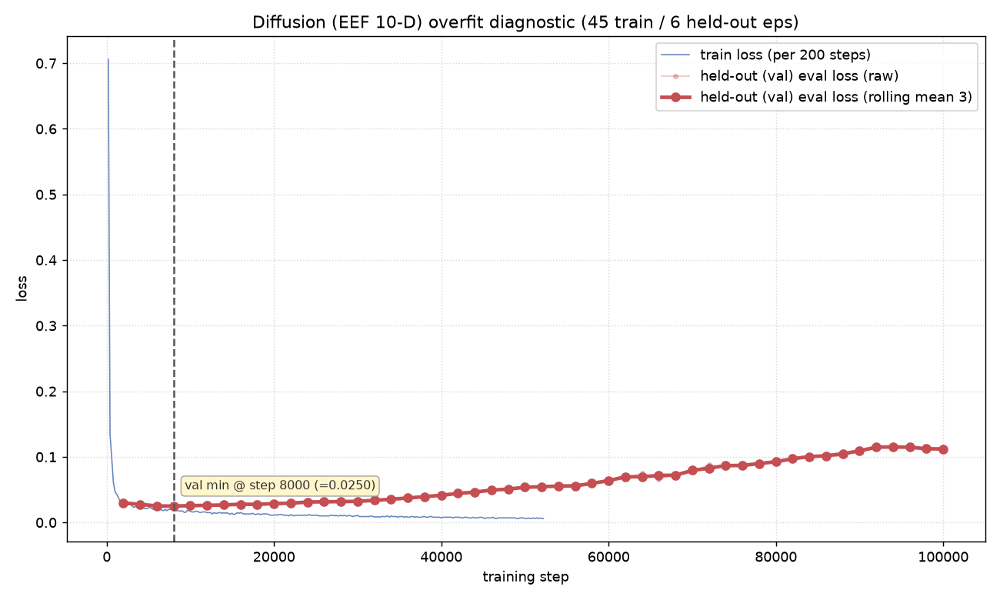

# Diffusion Policy (EEF, 10-D action) — Overfit Diagnostic

**Task:** put-right-banana-in-pot · **Split:** 45 train / 6 held-out episodes (eps 45–50) · **Steps:** 100k · **Sampler at eval:** DDIM-10

---

## TL;DR (read this)

- **The held-out denoising `eval_loss` is a MISLEADING signal for this diffusion policy.** It bottoms at **0.0250 @ 8k** and then rises ~4.5× to **0.112 @ 100k** — the auto-report calls this "OVERFIT from ~8k". **Ignore that verdict.**
- **The signal that actually matters — open-loop rollout MAE on the held-out episodes — IMPROVES monotonically and then plateaus.** No destructive overfitting through 100k.
- **Open-loop `poseMAE`** (EE's own scale): `0.0665 @10k → 0.0368 plateau from ~70k`, **minimum 0.03674 @ 80k**. **`gripAcc`** climbs steadily to **0.966 @ 100k**; **`overallL1`** is lowest at **100k (0.03754)**.
- **Best checkpoint = the 80k–100k plateau.** `poseMAE` is minimized at **80k** (0.03674); gripper accuracy and overall-L1 are best at **100k**. The three are within noise across 70k–100k, so **deploy 100k is safe and gives the best gripper** — there is no accuracy reason to early-stop.
- Select EE diffusion checkpoints by **open-loop rollout MAE, NOT `eval_loss`** — exactly the lesson from the JOINT diffusion run.

> **Units caveat.** The EE action is 10-D = `[x, y, z (meters), r1…r6 (6-D rotation, unitless), grip]`. Its `poseMAE` mixes meters and 6-D rotation and is **NOT comparable** to the JOINT model's radian `poseMAE` (0.0845). Judge EE only by its **own** trend.

---

## The figure (held-out eval_loss over training — the misleading signal)

The curve above is `eval_loss` (held-out denoising MSE). It looks like a textbook overfit from ~8k. It is not — see the open-loop table below.

---

## Why the two signals disagree (the whole point)

A diffusion policy is trained to predict the noise added at a **random** timestep. `eval_loss` scores exactly that random-timestep noise-prediction on held-out frames. But what drives the robot is the **sampled action** — the *integral* of the full reverse-diffusion trajectory (here DDIM-10). Those two quantities **decorrelate**: the network can get "worse" at random-timestep denoising MSE while the sampled action keeps getting **closer** to the ground-truth action. So `eval_loss` rising ≠ the policy getting worse. The only faithful held-out metric is to **actually sample actions and compare them to ground truth open-loop**, which is what `eval_offline.py` does (DDIM-10, held-out eps 45–50).

---

## Open-loop rollout results (the signal that matters)

`eval_offline.py`, DDIM-10, held-out eps 45–50. Numbers persisted at `../results/report_assets/diffusion_ee_openloop_eval.csv`.

| checkpoint | poseMAE (own scale ↓) | gripAcc (↑) | overallL1 (↓) |
|-----------:|----------------------:|------------:|--------------:|
| 10k | 0.06648 | 0.886 | 0.07517 |
| 20k | 0.04499 | 0.923 | 0.05031 |
| 30k | 0.04345 | 0.930 | 0.04839 |
| 40k | 0.03999 | 0.926 | 0.04440 |
| 50k | 0.03786 | 0.942 | 0.04126 |
| 60k | 0.03900 | 0.950 | 0.04131 |
| 70k | 0.03687 | 0.956 | 0.03846 |
| **80k** | **0.03674** ⟵ min | 0.961 | 0.03773 |
| 90k | 0.03718 | 0.955 | 0.03856 |
| **100k** | 0.03717 | **0.966** ⟵ max | **0.03754** ⟵ min |

**Read:** `poseMAE` falls 0.0665 → ~0.0368 and then flattens from ~70k (70k/80k/90k/100k all within ±0.0004 = noise). `gripAcc` rises essentially monotonically to 0.966 at 100k. `overallL1` is lowest at 100k. **No open-loop overfit anywhere through 100k.**

Contrast with `eval_loss` over the same run: 0.0331 @2k → **0.0250 @8k (min)** → 0.112 @100k. The two signals point in **opposite directions**.

---

## Verdict

- **No destructive overfitting through 100k** on the EE (10-D) diffusion policy.
- **Best = 80k–100k plateau.** `poseMAE` minimum at **80k (0.03674)**; **100k** gives the best gripper (0.966) and best overall-L1 (0.03754) with `poseMAE` tied within noise.
- **Deploy the 100k checkpoint** (or 80k if you want the strict `poseMAE` minimum) — either sits on the plateau. **Do not** use `eval_loss` to pick.
- **Same lesson as JOINT diffusion, reconfirmed:** for a diffusion policy, held-out denoising `eval_loss` is not a reliable overfit/early-stop signal; **open-loop rollout MAE is.**

## Relation to the JOINT diffusion result

| | JOINT (7-D, radians) | EEF (10-D, m + 6-D + grip) |
|---|---|---|
| eval_loss trend | rose ~5× (0.029→0.146) | rose ~4.5× (0.025→0.112) |
| eval_loss auto-verdict | "overfit" (misleading) | "overfit @8k" (misleading) |
| open-loop poseMAE | 0.1193→**0.0845** plateau ≥60k | 0.0665→**0.0368** plateau ≥70k |
| open-loop gripAcc | 0.729→**0.953** @80k | 0.886→**0.966** @100k |
| open-loop overfit? | **none through 80k** | **none through 100k** |
| best checkpoint | 80k | 80k–100k plateau (deploy 100k) |
| poseMAE comparable? | radians | **NO — different units, do not compare across the two rows** |

Both action spaces tell the identical story: **eval_loss misleads, open-loop is the truth, and there is no destructive overfit.** The JOINT model (7-D, directly actuatable, deployed) is on HF `Bigenlight/diffusion_banana_in_pot_joint`; the EEF model would additionally need inverse kinematics to actuate and is left as a research artifact.

---

## 부록 — 모델·데이터 사양 (EE)

아키텍처는 JOINT와 **동일**하다. 전체 상세(제어율 30Hz·프레임 사용, ResNet18+SpatialSoftmax 이미지 인코딩, 파라미터, 용량)는 **[`DIFFUSION_JOINT_OVERFIT.md` 부록](DIFFUSION_JOINT_OVERFIT.md)** 참조. EE 고유 차이만 정리:

- **제어율:** 데이터셋 30fps, 연속 프레임(step=1) 그대로 학습 — JOINT와 동일(다운샘플 없음). obs 2프레임(~0.067s) / horizon 64(2.13s) / exec 32(1.07s) @30Hz.
- **입력·출력 차원:** state **10-D**(`[x,y,z, r1..r6, grip]`), action **10-D**. 이미지 인코딩(카메라별 ResNet18 → 64-D, 2캠 → 128-D)은 동일.
  - obs당 조건 = `10 + 128 = 138-D` → `×n_obs_steps 2` → **global_cond = 276-D** (JOINT는 270-D).
- **파라미터·용량:** JOINT와 사실상 동일 **~277.9M / fp32 ~1.11 GB** (첫·마지막 레이어의 3-D 차이만큼만 미세하게 다름).
- **미배포:** EE action 10-D는 실제 구동에 **역기구학(IK)** 이 추가로 필요 → HF 업로드/배포 안 함(연구 산출물). 배포된 것은 7-D JOINT 모델뿐.
