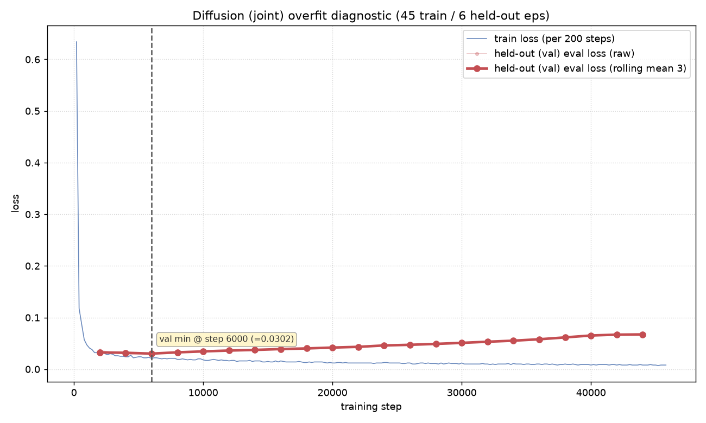

# Diffusion Policy (joint) — overfit diagnosis

_Diffusion Policy, JOINT 7-D action space. Trained on 45 episodes, 6 episodes (eps 45–50) held out as a true validation split. Ran to 80k steps. Two held-out signals were tracked: the denoising `eval_loss` (every 2k steps) and the deployment-relevant open-loop rollout MAE (`eval_offline.py`, DDIM-10, every 10k)._

## TL;DR — verdict

> **NO open-loop overfitting through 80k. Best checkpoint = 80k. Select diffusion checkpoints by open-loop MAE, NOT by `eval_loss`.**

The held-out **denoising `eval_loss` rose ~5×** (0.0289 @ 4k → 0.1487 @ 80k), which *looks* like severe overfitting and is what a naive early-stop rule flags. But the signal that actually matters for deployment — the **open-loop rollout MAE on the same held-out episodes — IMPROVED monotonically and then PLATEAUED** through 80k (poseMAE 0.1193 → 0.0845 rad; gripper accuracy 0.729 → 0.953). The model kept getting better (or held) on unseen data the entire run.

The two signals **decorrelate**, and for a diffusion policy the loss is the misleading one. Deploy the **80k** checkpoint; anything ≥60k is effectively equivalent on pose.

## Setup / method

- **Policy:** Diffusion Policy, JOINT action space (7-D: 6 arm joints + gripper).
- **Data:** 51 episodes total. `eval_split = 0.117` holds out the **last 6 episodes (45–50)** as a true validation set; the policy is **trained on the first 45**.
- **Training:** ran to **80k** steps. Train loss logged every 200 steps; held-out denoising `eval_loss` every 2k steps.
- **Open-loop eval:** `eval_offline.py`, **DDIM-10** sampling, teacher-forced over held-out eps 45–50, errors in **radians**. This is the deployment-relevant metric — it scores the *sampled action*, not the noise-prediction loss.

(Same 45-train / 6-held-out protocol as the ACT sibling diagnosis, so the two are directly comparable.)

## The figure

**Blue = held-out denoising `eval_loss`** (raw points faint + centered rolling-mean(3) bold). It bottoms early (~0.029 around 4–6k) then climbs steadily to ~0.15 — the textbook "val turns up while train falls" overfit shape. **This is the misleading signal.** The open-loop MAE curve (table below) tells the *opposite* story on the very same held-out episodes: it goes down and stays down.

## Why the two signals disagree (diffusion-specific)

The denoising `eval_loss` and the open-loop MAE measure fundamentally different things, and only for diffusion do they decouple this hard:

- **`eval_loss` scores noise prediction at *random* diffusion timesteps.** Each held-out eval draws a fresh noise vector and a random timestep, then measures how well the network predicts that noise. As training sharpens the network to the 45 training trajectories, its per-timestep noise-prediction on unseen episodes degrades — a real generalization gap on the *auxiliary* denoising objective. It is also stochastic by construction (hence the rolling-mean smoothing).
- **Open-loop MAE scores the *sampled action* — the integral of the full reverse process.** The deployed quantity is the endpoint of the DDIM-10 reverse chain, not any single-timestep residual. Errors at individual timesteps partially cancel over the reverse integration, so the sampled action can keep improving even as the pointwise denoising loss worsens.

Net: a rising denoising `eval_loss` is **not** evidence that the sampled policy generalizes worse. The reverse-process output is what deploys, and that is what open-loop MAE measures.

## Results

**Open-loop rollout MAE** — `eval_offline.py`, DDIM-10, held-out eps 45–50, radians:

| checkpoint | poseMAE (rad) | gripAcc | overall L1 |
|---|---|---|---|
| 10k | 0.1193 | 0.729 | 0.1454 |
| 20k | 0.1037 | 0.888 | 0.1078 |
| 30k | 0.0921 | 0.919 | 0.0928 |
| 40k | 0.0907 | 0.949 | 0.0862 |
| 50k | 0.0865 | 0.942 | 0.0832 |
| 60k | 0.0849 | 0.944 | 0.0812 |
| 70k | 0.0855 | 0.951 | 0.0809 |
| **80k** | **0.0845** | **0.953** | **0.0796** |

- poseMAE improves monotonically then **plateaus at ~0.085 from 60k onward** (60k/70k/80k = 0.0849/0.0855/0.0845, within eval noise).
- Gripper accuracy climbs all the way to **0.953 @ 80k**.
- **No open-loop overfitting through 80k.**

**Denoising `eval_loss` endpoints** (smoothed, rolling-mean 3): minimum **0.0289 @ ~4k** → **0.1487 @ 80k** (ratio ≈ 4.93). This is the signal a naive early-stop rule would have followed to stop at ~6k — and it would have been **wrong**, discarding 74k steps of genuine open-loop improvement.

## Contrast with ACT

The two policies behave differently, and this is the whole lesson:

- **ACT — signals AGREE.** Held-out `eval_loss` fell and never turned up, *and* open-loop MAE improved to ~30k then flattened. Both said "no destructive overfit." Either signal alone would have led you to the right checkpoint.
- **Diffusion — signals DISAGREE.** Held-out denoising `eval_loss` screams "5× overfit," while open-loop MAE says "still improving / plateaued, deploy latest." Trusting `eval_loss` here would throw away the best model.

See [`ACT_OVERFIT_DIAGNOSIS.md`](ACT_OVERFIT_DIAGNOSIS.md) for the ACT side.

## Conclusion / recommendation

- **Deploy the 80k checkpoint** — tied-best poseMAE (0.0845 rad) and best gripAcc (0.953). Checkpoints **≥60k are ~equivalent on pose**, so 60k/70k/80k are all safe choices; 80k wins on gripper.
- **Operational lesson for future diffusion runs:** the held-out **denoising `eval_loss` is NOT a valid overfit / early-stop signal** for a diffusion policy. Its rise reflects the auxiliary noise-prediction objective, not deployed-action quality. **Always select diffusion checkpoints by open-loop rollout MAE** (or, ultimately, closed-loop success), and run the open-loop eval across the full training curve before picking a checkpoint.
- **Caveat:** held-out eps 45–50 are the last 6 by collection order (chronological tail), not an i.i.d. random split, so the reported gap conflates generalization with any session drift. The "no open-loop overfit, select by MAE" conclusion is robust to this.

---

## 부록 — 모델·데이터 사양 (아키텍처 / 제어율 / 파라미터 / 용량)

> JOINT·EE 두 디퓨전 모델은 아키텍처가 사실상 동일하다(입력 state 7 vs 10, 출력 action 7 vs 10 차원만 다름). 아래 수치는 JOINT 기준이며 EE 차이는 각 항목에 병기했다.

### 1. 제어율 / 프레임 사용 — 30Hz, 다운샘플 없음
- 저장 데이터셋 **30fps**(RGB 비디오도 `video.fps=30`), JOINT·EE 동일, 21,524 프레임 / 51 에피소드.
- lerobot가 쓰는 프레임 오프셋이 **step=1**(연속) → 프레임 스킵 없이 **native 30Hz 그대로** 학습.
  - `observation_delta_indices = [-1, 0]` (연속 2프레임)
  - `action_delta_indices = [-1, 0, 1, … 62]` (연속 64프레임)

  | 항목 | 프레임 | @30Hz |
  |---|---|---|
  | obs 윈도우 (n_obs_steps=2) | 2 | ~0.067 s |
  | 예측 horizon (64) | 64 | 2.13 s |
  | 실행 chunk (n_action_steps=32) | 32 | 1.07 s |

- `drop_n_last_frames=31`은 **에피소드 끝 경계 처리**(64프레임 미래가 없는 꼬리를 윈도우 시작점에서 제외)일 뿐, **Hz 다운샘플이 아님**. 모든 프레임은 여전히 학습에 사용.
- **배포도 30Hz** (leader `publish_rate_hz=30`) → 학습 제어율과 일치.

### 2. 이미지 인코딩 — 패치/ViT 아님, ResNet18 + SpatialSoftmax
원조 Diffusion Policy(Chi et al. 2023) 방식. 이미지를 토큰화·어텐션하지 않고 **작은 조건 벡터로 압축**해 액션 U-Net을 조종한다.

1. 프레임 `3×360×640` → **ResNet18** conv trunk → feature map `512×12×20`
2. **SpatialSoftmax**: `1×1 conv`로 512→**32 키포인트**, 채널별 spatial softmax로 각 키포인트의 기대 좌표 `(x,y)` → **64-D/카메라** (→ `Linear(64→64)+ReLU`)
3. `use_separate_rgb_encoder_per_camera=True` → cam1·cam2 **각자 별도 ResNet18** → 이미지 128-D
4. +로봇 state → obs당 `7+128=135-D` (EE: `10+128=138-D`), `×n_obs_steps 2` → **global_cond = 270-D** (EE: **276-D**)
5. 이 조건 벡터 + diffusion timestep 임베딩이 **1D 시간축 U-Net**(액션 궤적 `(B,64,action_dim)`을 denoise)에 **FiLM(scale·bias)** 으로 주입 (`use_film_scale_modulation=True`)

→ 즉 이미지는 "패치 토큰"이 아니라 **주목 지점 32개의 좌표(64-D)** 로 축약되고, 액션 denoise의 **조건**으로만 쓰인다. 시간축 모델링은 액션 U-Net이 담당.

### 3. 파라미터 수 — 약 277.9M

| 요소 | 파라미터 | 비중 |
|---|---:|---:|
| 1D U-Net (액션 denoiser) | ~255.5M | 92% |
| RGB 인코더 (ResNet18 × 2, 카메라별) | ~22.4M | 8% |
| **합계** | **277,880,775 (~277.9M)** | 100% |

전부 trainable. EE 모델도 사실상 동일(첫/마지막 레이어 수백~수천 개만 차이). 참고로 ACT(~51M)의 5배+.

### 4. 저장 용량

| 형태 | 용량 | 비고 |
|---|---:|---|
| **fp32 가중치 (현재 저장본)** | **1.11 GB** | `model.safetensors` = 1,111,651,364 B = 1,060 MiB = 277.9M×4B |
| 체크포인트 폴더 전체 | ~1.1 GB | 거의 전부 가중치. config.json·normalizer stats 등 나머지는 수십 KB |
| fp16/bf16 변환 시 | ~0.56 GB | 추론 전용이면 절반으로 축소 가능 |
| int8 양자화 시 | ~0.28 GB | (로봇용은 보통 미사용) |

- **런타임 VRAM은 별개:** 학습 시 로그 기준 **~7.6 GB**(batch 8, 옵티마이저 포함), 배포 추론(batch 1, DDIM-10)은 그보다 훨씬 작아 RTX 3060(12GB)에서 여유. ACT 모델은 fp32 ~0.2 GB.
