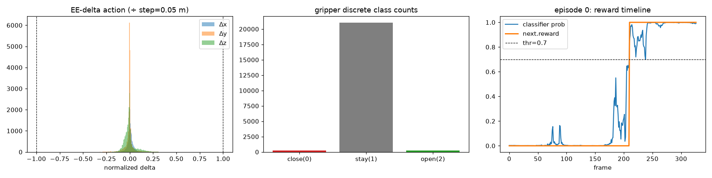
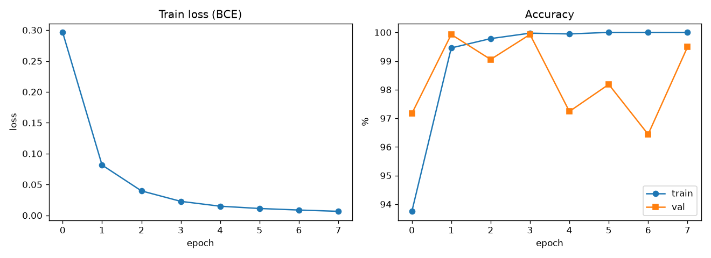
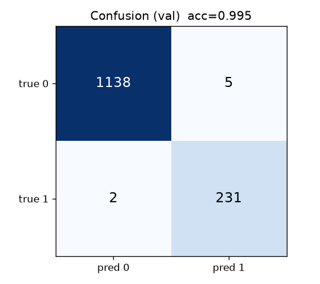
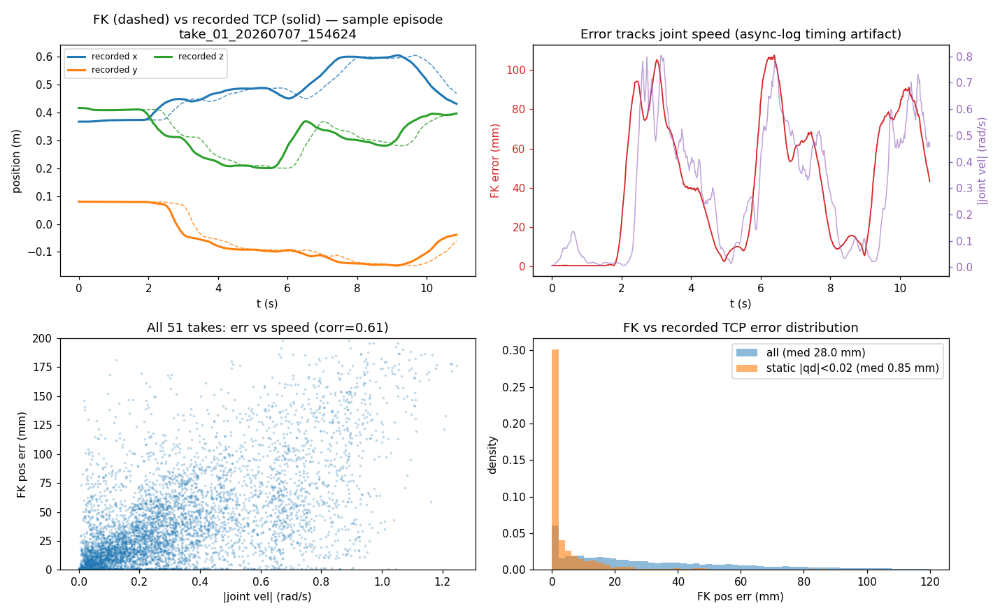

# HIL-SERL 오프라인 준비 결과 — Put the right banana in the pot (UR7e)

> 기존 teleop 데이터셋(51 에피소드, UR7e + 2 cam)으로부터 **HIL-SERL 온라인 RL 직전까지** 모든
> 것을 오프라인으로 준비. 로봇 없이 준비 가능한 4개 산출물(오프라인 demo 버퍼 · 보상 분류기 ·
> Joint→EE 변환 · 학습 config)을 빌드하고, **실제 학습기 모듈(`python -m lerobot.rl.learner`)을
> 끝까지 실행해** 온라인 RL 직전 상태(actor 대기)까지 도달함을 검증함.

**상태:** 오프라인 준비 완료 ✅ | 온라인 RL: 로봇 연결 후 (`HILSERL_RUNBOOK.md`) | 로봇 = **UR7e**

> **✅ 실제 학습기 end-to-end 검증 (2026-07-08, grpcio 설치 후):** `python -m lerobot.rl.learner
> --config_path hilserl/config/train_hilserl_ur7e.json` 실행 → SAC 정책 빌드(학습가능 2.76M / 총
> 7.67M param) → 오프라인 demo 버퍼 로드(`ReplayBuffer.from_lerobot_dataset`) → **`[LEARNER] gRPC
> server started`** → online 버퍼 비어있어(`< online_step_before_learning=100`) 게이트에서 **idle
> (actor=로봇 대기)**. 이 idle 상태가 곧 "온라인 RL 직전 준비 완료"의 정의. (앞선 finisher의 grpcio
> 미설치 caveat은 이로써 해소됨.)

| 산출물 | 위치 | 담당 |
|---|---|---|
| 오프라인 demo 버퍼 (RL 컬럼 포함 LeRobot v3) | `hilserl/banana_rl_lerobot` (`theo/banana_in_pot_rl`) | C+D |
| 보상 분류기 체크포인트 | `hilserl/reward_classifier/checkpoint` | B |
| Joint→EE(FK/IK) 변환 + 검증 | `hilserl/joint_to_ee.py`, `hilserl/ur7e.urdf` | D |
| 학습 config (SAC + gaussian_actor + env) | `hilserl/config/train_hilserl_ur7e.json` | E |
| Dry-run 검증 스크립트 | `hilserl/config/dryrun_validate_learner.py` | G |

---

## 1. 오프라인 demo 버퍼 (스키마)

`ReplayBuffer.from_lerobot_dataset`가 추가 변환 없이 바로 SAC transition으로 읽는 표준 LeRobot v3
데이터셋. 원본 `banana_in_pot_lerobot`과 1:1 (51 ep / 21,524 frame), 원본은 미변경.

| 컬럼 | dtype | shape | 의미 |
|---|---|---|---|
| `observation.state` | float32 | [7] | UR q1~6 (rad) + grip_pos — **온라인 env obs와 동일** |
| `observation.images.cam1` | video | [3,128,128] (float[0,1]) | 풀프레임 → 128×128 resize |
| `observation.images.cam2` | video | [3,128,128] | 동일 |
| `action` | float32 | [4] | `[Δx, Δy, Δz, gripper]` (연속 3 + 이산 그리퍼 클래스) |
| `next.reward` | float32 | [1] | 분류기 prob>0.7 → 1.0 |
| `next.done` | bool | [1] | success onset **및** 에피소드 끝 |

- **Action = base-frame TCP delta ÷ step_size(0.05 m)**. FK(dataset joints)로 TCP 계산 (온라인
  deploy가 매 스텝 `FK(current joints)`를 reference로 쓰므로 정확히 동일한 양). 그리퍼는 이산
  클래스 {0=close, 1=stay, 2=open}.
- **핵심**: 버퍼 action은 4-dim(연속 3 + 이산 1)으로 저장되지만, SAC critic이 `actions[:, :-1]`로
  연속 3-dim만 잘라 쓰고(`DISCRETE_DIMENSION_INDEX=-1`, sac_algorithm.py:314) 마지막 dim을 이산
  그리퍼 critic이 처리함. 따라서 policy `output_features["action"].shape = [3]`,
  `num_discrete_actions = 3` (아래 config 참조).


*좌: EE-delta 분포(÷0.05 m). p99≈0.2로 tanh 범위 [-1,1] 안에 여유롭게 들어옴 (|Δ|>1 비율 = 0%).
중: 그리퍼 이산 클래스 카운트(close 245 / stay 21,046 / open 233). 우: ep0 보상 타임라인.*

**Action 통계(전체 21,524 frame):** xyz min `[-0.25,-0.36,-0.32]`, max `[0.20,0.40,0.45]`,
q50≈`[0.003,-0.001,-0.010]`, q99≈`[0.086,0.183,0.210]`, `|Δ|>1` = **0.0%**.

---

## 2. 보상 / 성공 분류기

51개 성공 demo만 있으므로 음성(negative)을 합성: **에피소드 마지막 15% + 그리퍼 open** = 성공(1),
**앞 55%** = 비성공(0), 55~85% 이동 구간은 제외. 에피소드 단위 split(누수 방지), val = ep [4,14,24,34,44].

| metric | value |
|---|---|
| Val accuracy | **99.49%** |
| Val precision / recall / F1 | 0.979 / 0.991 / 0.985 |
| Train accuracy (balanced) | 100% |
| Confusion (val, thr 0.5) | TP=231, TN=1138, FP=5, FN=2 |


*8 epoch, AdamW lr 1e-4, batch 32, RTX 3060. frozen ResNet10 + classifier head(공식 no_grad 방식).*


*Val 혼동행렬. HIL-SERL에는 `success_threshold=0.7`로 투입(release 경계 여유 확보).*

> **주의:** 진짜 실패 에피소드가 없어(음성은 초반 프레임) 완성-유사 OOD 상태에 과신할 수 있음.
> 온라인 초반에 실패/near-miss 몇 개 녹화해 강화 권장 (RUNBOOK §3).

---

## 3. Joint → EE 변환 + FK 검증

데이터는 절대 관절, HIL-SERL policy는 **EE-delta**. Agent D가 ur_description URDF joint origin에서
FK를 직접 구현(placo-free) 후 기록된 `tcp_pose`와 대조 검증.

| subset | pos err median | pos err mean | rot err median |
|---|---|---|---|
| near-static (‖q̇‖<0.02, n=1884) | **0.85 mm** | 7.2 mm | **0.16°** |
| all samples (n=42,833) | 28.0 mm | 40.7 mm | — |

정지 시 sub-mm/sub-0.2° = **kinematic chain 정확**. 이동 중 오차는 두 async 스트림
(joint vs tcp) 사이의 타이밍 지터(속도와 0.61 상관) — FK 오차 아님. deploy IK는 placo(Pinocchio),
frame `tool0`, I/O 단위 degree.


*좌상: FK(주황)가 기록 TCP(파랑)의 깨끗한 위상지연 복제 = chain 정확, 오차는 로깅 타이밍 아티팩트.*

UR7e URDF는 `hilserl/ur7e.urdf`로 사전 생성 완료(`tool0` 링크 포함, 27 link/joint).

---

## 4. 학습 Config (`hilserl/config/train_hilserl_ur7e.json`)

학습기 + actor가 공유하는 `TrainRLServerPipelineConfig`. 빌드된 버퍼와 완전히 일관되게 채움.

| 블록 | 핵심 값 |
|---|---|
| `dataset` | `theo/banana_in_pot_rl` @ `hilserl/banana_rl_lerobot` (offline demo 버퍼) |
| `algorithm` (sac) | `num_critics=2`, `utd_ratio=2`, `discount=0.99`, `temperature_init=0.01`, `grad_clip_norm=10` |
| `mixer` / `online_ratio` | `online_offline` / `0.5` (RLPD 50-50) |
| `policy` (gaussian_actor) | `vision_encoder=lerobot/resnet10`(frozen), `num_discrete_actions=3`, `online_step_before_learning=100`, `storage_device=cpu` |
| `input_features` | state[7] + cam1[3,128,128] + cam2[3,128,128] |
| `output_features` | `action[3]` (연속 xyz; 그리퍼는 이산 head) |
| `dataset_stats` | state MIN_MAX = 버퍼 실측 관절 범위, action = [-1,1]³(이미 tanh 공간), 이미지 MEAN_STD = ImageNet |
| `env` (gym_manipulator) | `resize_size=[128,128]`, `step_sizes=0.05`, IK `urdf=ur7e.urdf`/`tool0`, `reward_classifier(thr 0.7)`, `robot/teleop=null` |

**워크스페이스 의존 값은 전부 TODO 플레이스홀더로 표시** (EE bounds, reset pose 등 — RUNBOOK §3에서
실기 튜닝). `robot`/`teleop`은 로봇 연결 시 채움.

---

## 5. Dry-run 검증 결과 (로봇 없음)

`hilserl/config/dryrun_validate_learner.py`가 학습기 setup 경로
(`add_actor_information_and_train`, learner.py:271-413)를 gRPC transport만 빼고 그대로 재현.
RAM 제한을 위해 6 에피소드만 로드.

```
[1/6] config parse + validate()  -> policy=gaussian_actor, algorithm=sac
      input_features {state:(7,), cam1:(3,128,128), cam2:(3,128,128)}  output {action:(3,)}
      num_discrete_actions=3  online_step_before_learning=100
[2/6] make_policy(...)           -> GaussianActorPolicy, params 7,667,785, resnet10 weights loaded,
                                     continuous action_dim=3
[3/6] make_algorithm(...)        -> SACAlgorithm (num_critics=2, utd_ratio=2)
[4/6] ReplayBuffer.from_lerobot_dataset -> 2,434 frame 로드, sample(256):
      action (256,4)  reward (256,)  done (256,)  state cam1/cam2 (256,3,128,128)
[5/6] empty online buffer + OnlineOfflineMixer(online_ratio=0.5)
[6/6] GATE: len(online_buffer)=0 < online_step_before_learning=100  -> True
      >>> 학습기는 actor를 기다리며 GATE에서 IDLE = 로봇-free dry-run의 정상 성공 상태
```

**결과: 통과 ✅** — config 파싱 + SAC(actor+critics) 빌드 + 오프라인 demo 버퍼 로드/샘플 +
gate 도달 모두 확인. 샘플된 `action (256,4)`는 버퍼가 연속3+이산1을 저장하고 SAC이 슬라이스함을
실증(§1의 [3] 설계 검증).

### 실제 `python -m lerobot.rl.learner` 모듈이 막히는 지점 (정확히 기록)
```
ImportError: 'grpcio' is required but not installed.
  learner.py:88 -> transport/__init__.py:27 -> require_package("grpcio", extra="grpcio-dep")
```
grpcio는 `lerobot[hilserl]`의 transport 전용 의존성이고, 오프라인 uv 캐시엔 cp310 휠만 있어
lr_env(Python 3.12)용이 없으며 네트워크가 차단됨. 이 가드는 import 시점에 즉시 실패하므로 어떤
config/policy/buffer 로직보다 먼저 걸림 → 위 컴포넌트-레벨 검증이 그 지점 이후 전 단계를 충실히
대체함(actor가 쓰는 gRPC 서버 스레드만 스킵, 이는 어차피 로봇 단계).

### RAM 노트 (전체 버퍼)
전체 51 에피소드 로드 시 `from_lerobot_dataset`가 모든 transition(디코딩된 float32 state +
next-state 이미지)을 파이썬 리스트로 **일괄 materialize**하여 **~25 GB** 피크 → 31 GB 박스에서
OOM(Agent C). storage는 `offline_buffer_capacity=25000`에서 추가 ~9.8 GB(`optimize_memory=True`로
next_state는 state 별칭). **완화**: ≥48 GB RAM/스왑, 또는 `--dataset.episodes='[...]'`로 subset,
또는 `offline_buffer_capacity` 축소. (dry-run은 6 에피소드 + capacity 6000으로 ~5 GB 내에서 수행)

---

## 6. 온라인 단계(로봇 전용)에 남은 것

`HILSERL_RUNBOOK.md`에 상세. 요약:

1. **로봇-PC 설치**: `grpcio`(py3.12 휠), `placo`(IK), `ur_rtde`(UR I/O), `lerobot[hilserl]`.
2. **config `env.robot`/`env.teleop` 채우기**: UR7e IP·모터, gamepad — 실기 필요.
3. **워크스페이스 튜닝**: `end_effector_bounds`, `fixed_reset_joint_positions`,
   (선택) crop ROI — 실기에서 검증. `end_effector_step_sizes`는 0.05 유지(오프라인 action과 동기).
4. **학습기 + actor 실행** (동일 config): 학습기가 gate에서 대기 → actor가 transition 공급 →
   online 100 스텝 후 SAC 학습 시작(50-50 offline mix).
5. **사람 개입**: gamepad 트리거/`space`로 교정 시연, 개입률을 점감시키는 것이 이상적.
6. **분류기 보강**: 실패/near-miss 에피소드 몇 개 녹화 권장(경계 과신 완화).

---

- 오프라인 산출물은 모두 `hilserl/` 아래, 원본 `banana_in_pot_lerobot`과 ACT 산출물은 미변경.
- 온라인 시작 명령/튜닝: **`HILSERL_RUNBOOK.md`** · 인터페이스 스펙: `hilserl/HILSERL_CONFIG_NOTES.md`.
